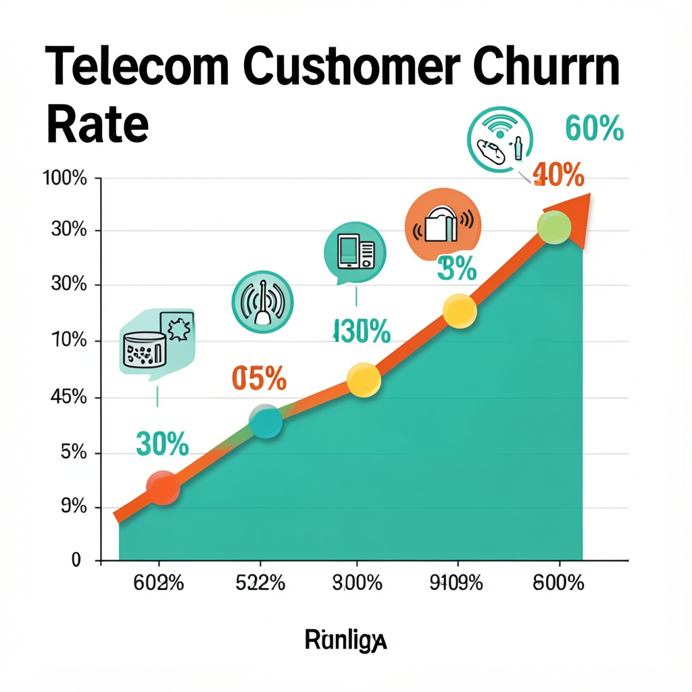

#  Telco Customer Churn Analysis
#### by Korir Edwin

---

##  Project Overview

This project analyses the Telco Customer Churn dataset from Kaggle to identify patterns behind customer churn and build a machine learning model to predict customer retention.

The workflow follows the **CRISP-DM (Cross-Industry Standard Process for Data Mining)** methodology, covering all six phases from Business Understanding through to Deployment. It combines **SQL data cleaning, Power BI dashboards for visual exploration, and Python-based predictive modelling** using a **Random Forest classifier**.

---

##  CRISP-DM Methodology

| Phase | Description | Tools |
|---|---|---|
| 1. Business Understanding | Define objectives, success criteria, and research questions | — |
| 2. Data Understanding | Explore structure, distributions, and data quality | Python, Power BI |
| 3. Data Preparation | Clean, encode, and engineer features | SQL, Python |
| 4. Modelling | Train Random Forest classifier | scikit-learn |
| 5. Evaluation | Assess performance with F1, AUC, confusion matrix | scikit-learn, matplotlib |
| 6. Deployment | Risk scoring, business recommendations | Python |

---

 Stakeholders

 

| Stakeholder | Role | Key Interests & Concerns | Influence Level | Recommended Actions |
|---|---|---|---|---|
| **Chief Revenue Officer (CRO)** | Executive Sponsor | Revenue impact of churn, LTV trends, ROI of retention programmes | 🔴 High | Present monthly churn KPIs and LTV gap analysis; frame recommendations in revenue terms |
| **Marketing Manager** | Primary User | Customer segmentation, campaign targeting, contract migration opportunities | 🔴 High | Provide High-Risk customer lists scored by churn probability for targeted retention campaigns |
| **Product Manager** | Primary User | Fiber optic service quality issues, feature adoption, contract incentive design | 🔴 High | Share Fiber optic churn rate findings and early-lifecycle drop-off data to inform product decisions |
| **Data Science Team** | Model Owners | Model accuracy, retraining cadence, feature pipeline, class imbalance handling | 🔴 High | Maintain monthly scoring pipeline; explore SMOTE, threshold tuning, and XGBoost benchmarking |
| **CRM / Customer Success Team** | Operational Users | Timely churn alerts, actionable customer flags, ease of integration | 🟡 Medium | Integrate risk tier scores into CRM workflows; trigger automated outreach for High-Risk customers |
| **Finance Team** | Reviewer | Cost of retention programmes vs. LTV saved, budget justification | 🟡 Medium | Use LTV differential (~2×) to set maximum justifiable retention spend per at-risk customer |
| **Network / Technical Operations** | Subject Matter Expert | Root cause of Fiber optic churn, service reliability metrics | 🟡 Medium | Investigate service quality and SLA data for Fiber optic segment; feed findings back into model |
| **Customer Support Team** | Data Contributors | Early churn signals from support contacts and complaints | 🟢 Low | Log service issues and escalation events as potential future model features |

---

 Tools & Technologies

 

**SQL Server** – Data cleaning and preprocessing  
**Power BI** – Interactive dashboards and visual insights  
**Python (Jupyter Notebook)** – Machine learning, EDA, and model evaluation  

**Libraries Used**
- `pandas` — Data manipulation
- `numpy` — Numerical operations
- `matplotlib` / `seaborn` — Data visualisation
- `scikit-learn` — Machine learning (Random Forest, metrics, preprocessing)

---

 Dataset

 

**Dataset Source:**  
https://www.kaggle.com/datasets/blastchar/telco-customer-churn

The dataset contains **7,043 rows (customers)** and **21 columns (features)**, covering:

- Customer demographics (gender, senior citizen, partner, dependents)
- Service subscriptions (phone, internet, streaming, security add-ons)
- Account information (contract type, tenure, billing method)
- Financial details (monthly charges, total charges)
- Churn status (target variable)

**Class Distribution:**
- Retained customers: ~73.5%
- Churned customers: ~26.5%

>  The class imbalance means accuracy alone is a misleading metric — the notebook prioritises F1-Score and ROC-AUC for evaluation.

### Data Preparation

Data cleaning was performed in **SQL Server**, including:

- Handling missing values
- Converting the `TotalCharges` column from string to numeric
- Mapping the `Churn` column to binary values (Yes → 1, No → 0)

In Python, additional preparation steps include:

- Imputing remaining blank `TotalCharges` entries using `MonthlyCharges × tenure`
- Label encoding all categorical features
- Stratified train/test splitting to preserve the churn ratio
- Engineering the **Lifetime Value (LTV)** feature: `MonthlyCharges × tenure`

The cleaned dataset was then imported into **Power BI** for visualisation and **Python** for machine learning.

---

 Data Visualisation (Power BI)

 

An interactive Power BI dashboard was built to explore:

- Customer churn patterns and class distribution
- Tenure distributions for churned vs. retained customers
- Churn rate breakdowns by contract type and internet service
- Customer Lifetime Value (LTV) segmentation
- Feature-level impact on revenue and churn behaviour

These insights informed the research questions and modelling approach.

---

 Research Questions (EDA)

 

The notebook addresses five core business research questions through exploratory data analysis:

1. **Tenure vs Churn** — How does customer tenure differ between churned and retained customers?
2. **Internet Service vs Churn** — Which internet service type has the highest churn rate?
3. **Contract Type vs Churn** — Do month-to-month customers churn significantly more?
4. **LTV Analysis** — What is the financial value gap between churned and retained customers?
5. **LTV Drivers** — Which categorical variable most strongly influences Lifetime Value?

Each question is answered with dedicated visualisations and a findings summary cell.

---

 Machine Learning Model

 

A **Random Forest Classifier** was used to predict customer churn.

**Why Random Forest?**
- Handles mixed categorical and numeric features without scaling
- Built-in feature importance for business interpretability
- Resistant to overfitting through ensemble averaging

**Model Configuration**

| Parameter | Value |
|---|---|
| Train/Test Split | 80 / 20 (stratified) |
| n_estimators | 100 |
| random_state | 42 |
| n_jobs | -1 (parallelised) |

### Model Evaluation

| Metric | Class 0 (Retained) | Class 1 (Churned) |
|---|---|---|
| Precision | 83% | 67% |
| Recall | 92% | 46% |
| F1-Score | 87% | 55% |

**Overall Accuracy:** 80%  
**ROC-AUC Score:** ~0.84

> The lower recall on churners (Class 1) is expected given the class imbalance. Threshold tuning can improve recall if the business prioritises catching more at-risk customers over precision.

### Top 5 Predictors (Feature Importance)

1. `tenure`
2. `TotalCharges`
3. `MonthlyCharges`
4. `LTV` *(engineered feature)*
5. `Contract`

---

 Key Findings

 

**1️ Customer Tenure**

Churned customers average **~18 months** of tenure vs. **~38 months** for retained customers — a 52% gap. The first 12–24 months is the highest-risk churn window. `tenure` was the single most important model feature.

**2️ Internet Service**

| Service Type | Churn Rate |
|---|---|
| Fiber Optic | ~42% |
| DSL | ~20% |
| No Internet | ~7% |

Fiber optic customers churn at over 1.6× the overall average, suggesting service quality or pricing issues.

**3️ Contract Type**

| Contract | Churn Rate |
|---|---|
| Month-to-month | ~43% |
| One year | ~11% |
| Two year | ~3% |

Month-to-month contracts carry ~9× the churn risk of two-year contracts. This is the highest-impact variable for retention strategy.

**4️ Lifetime Value (LTV)**

Retained customers generate approximately **2× the Lifetime Value** of churned customers. Most churned customers leave within the first 12 months before generating significant revenue.

**5️ Feature Influence on LTV**

- **Highest impact:** `InternetService`, `Contract`
- **Moderate impact:** `PaymentMethod`, `Partner`
- **Minimal impact:** `Gender`, `Dependents`

Connectivity and billing model choices define customer value far more than demographics.

---

 Churn Risk Scoring

 

The trained model assigns each customer a churn probability score, enabling tiered outreach:

| Risk Tier | Churn Probability | Action |
|---|---|---|
| 🟢 Low Risk | < 30% | Routine engagement |
| 🟡 Medium Risk | 30% – 60% | Proactive check-in |
| 🔴 High Risk | > 60% | Immediate retention intervention |

This scoring logic can be integrated into CRM workflows for automated, real-time retention campaigns.

---

 Business Recommendations

 

**1. Launch a Contract Migration Campaign**  
Offer month-to-month customers discounted annual plans or bundled perks (e.g., free streaming, device protection). A 10–15% conversion could reduce overall churn by ~4 percentage points.

**2. Investigate Fiber Optic Service Quality**  
Run proactive NPS surveys for Fiber optic customers in months 1–6. Review pricing competitiveness and technical support SLAs — this segment churns at 42% despite being high-value.

**3. Deploy the Churn Model in Production**  
Score all active customers monthly. Trigger automated CRM retention workflows for customers flagged as High Risk (churn probability > 60%).

**4. Build an Early-Lifecycle Engagement Programme**  
Most churn occurs within the first 18 months. A structured onboarding journey with regular touchpoints, tutorials, and loyalty milestones can significantly reduce early churn.

**5. Allocate Retention Spend by LTV Segment**  
Prioritise retention budget for customers with Fiber optic service on month-to-month contracts — this profile represents the highest LTV at risk. Customers on two-year plans with no internet service require minimal intervention.

---

 Limitations & Next Steps

 

| Limitation | Recommended Improvement |
|---|---|
| Class imbalance (~26.5% churn) | Apply SMOTE oversampling or `class_weight` balancing |
| Label encoding ordinal assumptions | Use One-Hot Encoding for nominal features in future iterations |
| No temporal features | Add recency of plan changes, service calls, and billing events |
| Single algorithm | Benchmark against XGBoost, LightGBM, and Logistic Regression |
| Default 0.5 threshold | Tune using precision-recall curve for business-optimal cutoff |
| No external validation | Validate on a separate holdout cohort or time period |

---

##  Contact

| | |
|---|---|
| **Name** | Edwin Korir |
| **Email** | [ekorir99@gmail.com](mailto:ekorir99@gmail.com) |
| **GitHub** | [github.com/Edwinkorir38](https://github.com/Edwinkorir38) |
| **LinkedIn** | [linkedin.com/in/edwin-korir-90a794382](https://linkedin.com/in/edwin-korir-90a794382) |

---
*Methodology: CRISP-DM | Model: Random Forest (scikit-learn) | Dataset: 7,043 customers, 21 features*
